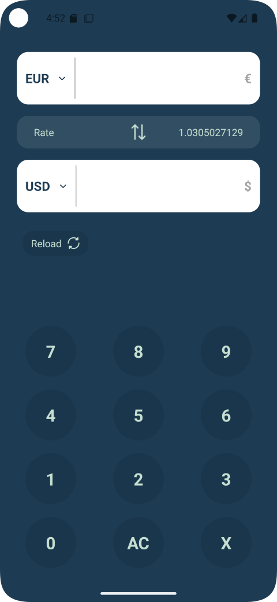

<h1> Simple Currency Converter </h1>
<h2> Application overview </h2>

Currency Converter is a simple Android application that converts between currencies in real-time thanks to the API from [FreeCurrencyAPI](https://app.freecurrencyapi.com/). It is constructed based on MVVM architecture to ensure clean separation and easy maintenance.
<h2> Application's structure </h2>

```
src/
├── main/
│   ├── java/
│   │   └── com.vkbao.currencyconverter/
│   │       ├── data/                
│   │       │   ├── remote/               
│   │       │   ├── models/         
│   │       │   └── repositories/   
│   │       ├── di/                  
│   │       ├── ui/                  
│   │       │   ├── activities/            
│   │       │   ├── adapters/      
│   │       │   ├── custom_views/      
│   │       │   ├── dialogs/  
│   │       │   └── viewmodels/      
│   │       ├── core/               
│   │       │   ├── constants/   
│   │       │   ├── utils/   
│   │       └── App.kt               
│   ├── res/                         
│   ├── AndroidManifest.xml          
│   └── build.gradle     

```
- ```data```: Handle all data-related components
    - ```remote```: Contains API services for network communication
    - ```models```: Defines data models
    - ```repository```: Contains business logic and data-handling classes
- ```di```: Injection Dependency using the Hilt library
- ```ui```: Contains UI components
    - ```acitivities```: Manages user interaction logic and displays the interface
    - ```adapters```: Bridges the view with underlying data fetched from ViewModels
    - ```custom views```: Contains custom view suited design requirement
    - ```view models```: Manages and processes data from the repository
    - ```dialogs```: Contains dialogs for notification such as Error, Success
- ```core ```: Utility classes and helper functions

<h2> Tech stack </h2>

- Language: Kotlin
- Architecture: MVVM
- Libraries:
    - Retrofit
    - Dagger/Hilt
    - Flow, Coroutines
    - LiveData, ViewModel

<h2> Features </h2>

- Fetches live exchange rates using the Free Currency API.
- Allows input of an amount in the "From" field and displays the converted amount in the "To" field.
- Enables selection of currencies for both "From" and "To" fields through dropdown menus.
- Displays the exchange rate ratio between two currencies.
- Supports a customized numeric keyboard with a user-friendly interface.

<h2> Installation and Setup </h2>
<h3> Prerequisites </h3>

- Android Studio (recommended version: Koala)
- An API key from [FreeCurrencyAPI](https://app.freecurrencyapi.com/)

<h3> Steps </h3>

- Clone this project ```git clone https://github.com/baovkb/TymeX_Round2_OnlineTest.git ```
- Open (or create) ```local.properties``` file and set your API key using the ```api_key``` property. Example: ```api_key=abc123```
- Build and run on an emulator or a physical device

<h2> Demo </h2>

For more details, watch the demonstration in this [video](https://youtu.be/VAg_DNEx7uI)


